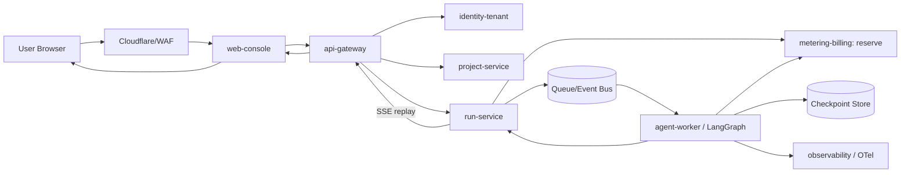
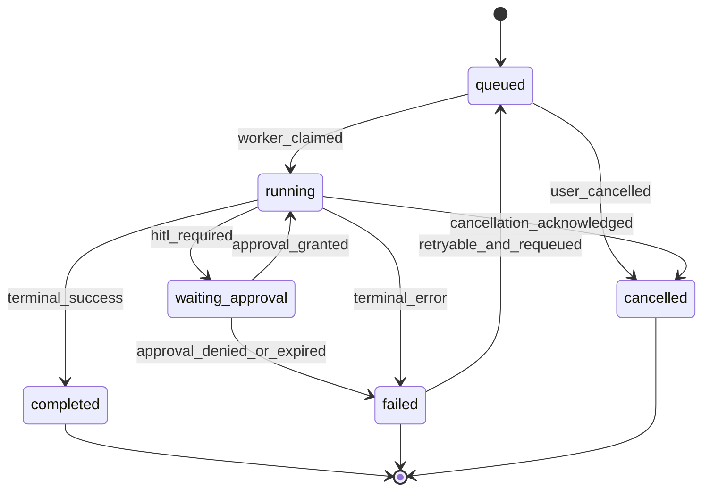
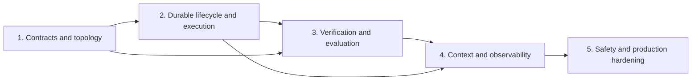

# SOT Harness Document — Production-Ready AI SaaS Foundation (MSA)

> MSA 방식으로 배포 가능한 AI SaaS 공통 기저 템플릿을 설계하기 위한 연구 근거형 SOT 문서. 실제 구현은 이 문서의 범위에 포함하지 않는다.

**Session**: `ai-saas-msa-20260918`
**Status**: `approved-baseline`
**Generated**: by `/dev-kit:sot-harness-writer`
**Decision mode**: 사용자가 권한을 위임하여 각 라운드의 권장안을 자동 `accept`

---

## 0. Scope and Non-goals

### In scope

- Next.js 기반 웹 콘솔과 Python/FastAPI 기반 AI 실행 계층
- 조직·멤버십·RBAC·RLS를 포함한 멀티테넌시
- 장기 실행 LangGraph 워크플로, 큐, 체크포인트, SSE 스트리밍
- 원자적 토큰/크레딧 원장과 결제 웹훅 경계
- OTel 기반 트레이싱, 평가 게이트, 서비스별 배포 및 CI/CD
- 서비스 간 REST/SSE/비동기 이벤트 계약과 MSA 운영 경계

### Out of scope

- 이 문서에서 애플리케이션 코드, Terraform, Dockerfile 또는 CI workflow를 직접 작성하지 않는다.
- 특정 도메인의 에이전트 프롬프트와 도메인 데이터 모델은 확장 프로젝트의 책임이다.
- 프로바이더 가격, 클라우드 리전, 실제 결제 플랜의 최종 값은 구현 전 별도 ADR로 확정한다.
- 실제 Google/Toss/Lemon Squeezy 연동과 관리자 화면 구현은 후속 build 단계의 책임이다.

### Boundary: MSA와 agent harness

`project_context`부터 `lifecycle`까지의 선택은 **개발/실행 에이전트 하네스**의 운영 원칙이다. MSA는 별도의 **제품 런타임 아키텍처**로 정의한다. 따라서 MSA 서비스 분해가 곧 여러 LLM 에이전트를 무조건 병렬화한다는 뜻은 아니다.

### Reference SOT integration

The reference SOT contracts were copied into this repository and are now part
of this plan's required reading set. They are normative inputs for the future
implementation plan, not new implementation work:

- `auth-google-oauth` — Google identity and session
- `admin-operations-audit` — privileged operations and audit
- `billing-admin-runbook` — operator navigation
- `billing-provider-adapter-architecture` — provider ports and registry
- `billing-payment-webhooks-ledger` — webhook inbox and ledger effects
- `billing-subscriptions-entitlements` — plans and access state
- `billing-provider-lemon-squeezy` — Lemon Squeezy adapter contract
- `billing-provider-toss-payments` — Toss Payments adapter contract

---

## 1. MSA Architecture Contract

### 1.1 Service catalog

| Service | Owns | Synchronous contract | Asynchronous contract | Data ownership |
|---|---|---|---|---|
| `web-console` | Next.js UI, session-aware routing, SSE client | BFF/API calls | UI run events | none; reads through APIs |
| `api-gateway` | public API, authn propagation, rate limiting, request correlation | REST/JSON, SSE | publishes accepted commands | no business tables |
| `identity-tenant` | Google OAuth, users, organizations, memberships, RBAC, invitations | tenant/member/session APIs | `member.invited`, `membership.changed` | identity and membership schema |
| `project-service` | AI project metadata, system instructions, provider config references | project CRUD APIs | `project.updated` | project schema |
| `run-service` | run state machine, idempotency, status, stream fan-out | create/status/approval APIs, SSE | `run.requested`, `run.state_changed` | runs and run events |
| `agent-worker` | LangGraph execution, tools, checkpoints, retries | internal worker protocol | consumes `run.requested`, emits tokens/state/failure | checkpoints and execution artifacts |
| `metering-billing` | pricing snapshots, reservations, usage ledger, provider registry/adapters, payment webhooks | quote/reserve/commit/checkout APIs | `credits.reserved`, `usage.committed`, `credits.purchased`, `billing.event_received` | billing order, provider inbox, entitlement, and ledger schemas |
| `admin-operations` | privileged support actions, reconciliation, audit events | authenticated admin APIs | `admin.action_recorded`, `billing.reconciliation_requested` | append-only audit schema |
| `observability` | OTel collection, redaction, trace export, evaluation records | health/trace ingestion | trace and evaluation events | telemetry/evaluation store |

### 1.2 MSA boundary rules

1. A service owns its tables and publishes versioned contracts; another service does not write those tables directly.
2. The initial deployment may use one PostgreSQL cluster with separate schemas and ownership grants. This is an operational simplification, not permission to create cross-service table coupling.
3. Cross-service mutations use APIs or durable events. A run may not deduct credits by directly updating the organization row.
4. Every command carries `request_id`, `tenant_id`, `actor_id`, `idempotency_key`, and `trace_id` where applicable.
5. Events are at-least-once. Consumers must be idempotent, and event payloads must include a stable aggregate ID and schema version.
6. Tenant identity is verified at the gateway and re-authorized at each business-service boundary. RLS is defense in depth, not the sole authorization mechanism.
7. Streaming is a projection of run state. Reconnection must recover from persisted run events/checkpoints; it must not depend on an in-memory worker process.
8. Google authentication proves identity only. Admin access requires server-side role/scope checks; billing entitlement is never inferred from the login provider or email address.
9. Provider-specific code is confined to billing adapters. The domain consumes normalized events and never imports a Toss or Lemon Squeezy SDK.
10. A mock provider may exist only in local/test environments and must implement the same capability ports, inbox, ledger, entitlement, and audit path as real providers.

### 1.3 Primary flow



---

## 2. Five-Dimension Harness Decisions

The five dimensions follow the harness decomposition described by Fowler/Böckeler and Anthropic. All five decisions are locked; each accepted recommendation retains its source URL.

## 2.1 Project Context

**Question**: What is the project's primary agent-harness category?

### Recommendations surfaced

| ID | Thesis | Source |
|---|---|---|
| `long_running` | Long-running autonomous work should use an initializer, incremental sessions, durable progress artifacts, and clean handoffs across context windows. | https://www.anthropic.com/engineering/effective-harnesses-for-long-running-agents |
| `multi_agent_research` | An orchestrator-worker system is effective for open-ended research that benefits from parallel, independent context windows. | https://www.anthropic.com/engineering/multi-agent-research-system |
| `single_agent_coding` | A single coding agent with a tight tool set is appropriate when work fits in one context window. | https://github.com/SWE-agent/SWE-agent |

### Decision: `accept` → `long_running`

**Chosen pattern**: The template is a long-running agent harness. It must support incremental execution, durable run state, checkpoint recovery, and handoff artifacts across sessions. **Source**: https://www.anthropic.com/engineering/effective-harnesses-for-long-running-agents

**MSA interpretation**: Runtime services remain independently deployable, but the agent execution path uses one durable run identity across gateway, queue, worker, metering, and observability. MSA boundaries do not permit a worker restart to lose the run contract.

**Why the other recommendations were not selected**: `multi_agent_research` is a useful execution pattern for research-heavy products but is too narrow as the foundation category; `single_agent_coding` does not cover multi-session production work or long-running agent tasks. These are boundary notes, not rejected decisions.

## 2.2 Verification

**Question**: How will you verify the agent's work?

### Recommendations surfaced

| ID | Thesis | Source |
|---|---|---|
| `self_verification_browser` | Browser automation and explicit self-verification validate the running application end to end. | https://www.anthropic.com/engineering/effective-harnesses-for-long-running-agents |
| `generator_evaluator_split` | A separate evaluator uses a negotiated contract and Playwright-driven checks to provide concrete feedback beyond self-critique. | https://www.anthropic.com/engineering/harness-design-long-running-apps |
| `deterministic_only` | Lint, type checks, unit tests, and contract tests provide cheap machine-checked gates. | https://martinfowler.com/articles/exploring-gen-ai/harness-engineering.html |

### Decision: `accept` → `generator_evaluator_split`

**Chosen pattern**: Every implementation slice has a generator contract and an evaluator contract. The evaluator runs service contract tests, queue/retry scenarios, RLS isolation checks, billing concurrency tests, and Playwright E2E flows against a running environment. **Source**: https://www.anthropic.com/engineering/harness-design-long-running-apps

**Verification policy**:

- Deterministic checks are mandatory prerequisites: lint, type checking, unit tests, migration checks, API schema checks, and security scans.
- Evaluator checks are mandatory for changes crossing a service boundary or user-visible flow.
- A run is not complete from a green unit-test result alone; the evaluator must verify the observable contract.
- Evaluation artifacts include command, environment, commit SHA, service versions, trace ID, test count, and exit code.

**Why the other recommendations were not selected**: `self_verification_browser` alone leaves too much of the final judgment with the generating agent; `deterministic_only` misses semantic and cross-service regressions that compile and unit-test successfully. Both remain fallback layers inside the selected split.

## 2.3 Context

**Question**: How will you manage the context window?

### Recommendations surfaced

| ID | Thesis | Source |
|---|---|---|
| `frequent_intentional_compaction` | Keep context bounded, compact intentionally, and use fresh subagent contexts for search and summarization. | https://www.humanlayer.dev/blog/advanced-context-engineering |
| `filesystem_memory` | Use durable files such as research, plan, feature, and progress artifacts as restorable external memory. | https://www.anthropic.com/engineering/effective-harnesses-for-long-running-agents |
| `subagent_firewall` | Isolate complex subtasks in fresh contexts and return only summaries to the orchestrator. | https://blog.langchain.com/improving-deep-agents-with-harness-engineering/ |

### Decision: `accept` → `filesystem_memory`

**Chosen pattern**: Durable handoff files are the canonical context memory for the build harness: `PRD.md`, service contracts, `feature_list.json`, `progress.log`, evaluation reports, ADRs, and open-questions records. **Source**: https://www.anthropic.com/engineering/effective-harnesses-for-long-running-agents

**Context contract**:

- Agents read the current worktree, service map, active phase, recent progress, and failing verification artifacts before editing.
- Agents write a bounded progress update and verification evidence before session handoff.
- Conversation history is not the system of record for requirements, decisions, or run state.
- Runtime agent memory uses persisted checkpoints and event replay; it is separate from developer-harness handoff files.

**Why the other recommendations were not selected**: frequent compaction is useful as an implementation optimization but is insufficient as durable project memory; the subagent firewall is optional for specialized tasks and would obscure the primary MSA contract unless its outputs are also persisted.

## 2.4 Safety

**Question**: What safety perimeter?

### Recommendations surfaced

| ID | Thesis | Source |
|---|---|---|
| `os_sandbox` | OS-level sandboxing plus a domain-routed proxy isolates filesystem and network capabilities. | https://www.anthropic.com/engineering/claude-code-sandboxing |
| `worktree_isolation` | Each change set uses its own branch and worktree; the main checkout is protected by guards. | https://martinfowler.com/articles/exploring-gen-ai/harness-engineering.html |
| `contract_of_intent` | A capability-aware grammar can encode intent, success criteria, and forbidden capabilities. | https://github.com/hyun06000/AIL |

### Decision: `accept` → `worktree_isolation`

**Chosen pattern**: Every implementation change occurs in a dedicated branch/worktree; the main checkout is read-only for edits, and merge/review is the authorization boundary. **Source**: https://martinfowler.com/articles/exploring-gen-ai/harness-engineering.html

**Safety contract**:

- No agent writes implementation or SOT artifacts in the main checkout.
- Service-to-service credentials use secret injection; secrets never enter logs, prompts, traces, or event payloads.
- Tenant data is isolated by identity checks, service ownership, and RLS defense in depth.
- External side effects require explicit service contracts, idempotency keys, timeouts, retries, and audit records.
- Production payment, destructive data operations, and infrastructure changes require a human-controlled approval boundary.

**Why the other recommendations were not selected**: `os_sandbox` provides stronger process isolation but is not required for this documentation-only baseline and introduces platform/proxy complexity; `contract_of_intent` remains research-grade and is not a production dependency for this template. Both may be revisited for high-risk extensions.

## 2.5 Lifecycle

**Question**: What session lifecycle?

### Recommendations surfaced

| ID | Thesis | Source |
|---|---|---|
| `initializer_progress` | An initializer creates the environment, feature list, startup script, progress log, and initial commit; later sessions orient from those artifacts. | https://www.anthropic.com/engineering/effective-harnesses-for-long-running-agents |
| `ralph_loop` | A bounded single-task loop allocates context deterministically and repeats until budget or success. | https://ghuntley.com/ralph/ |
| `eval_iteration` | A pre-completion checklist and evaluation middleware force verification before completion. | https://blog.langchain.com/improving-deep-agents-with-harness-engineering/ |

### Decision: `accept` → `initializer_progress`

**Chosen pattern**: The first session initializes the repository contract and service map. Each following session selects one bounded feature or service contract, verifies it, records progress, and leaves a clean handoff. **Source**: https://www.anthropic.com/engineering/effective-harnesses-for-long-running-agents

**Lifecycle states**:

```text
proposed → initialized → in_progress → awaiting_evaluation →
  (repair_required → in_progress)* → verified → handed_off → merged
```

**Required durable artifacts**:

- `service-catalog.md`: service ownership and dependency map
- `contracts/`: versioned API/event schemas
- `feature_list.json`: one observable acceptance target per feature
- `progress.log`: completed work, failed checks, and next action
- `evaluation/`: reproducible verification outputs
- `adr/`: decisions that change service boundaries or operational assumptions

**Why the other recommendations were not selected**: `ralph_loop` can be layered onto the session runner but is not sufficient as the system-of-record lifecycle; `eval_iteration` is selected as part of verification, not duplicated as the lifecycle owner.

---

## 3. Data and Contract SOT

### 3.1 Canonical entities

The proposal's six entities remain the logical domain model, with ownership assigned as follows:

| Entity | Owning service | Required invariants |
|---|---|---|
| Organizations | `identity-tenant` | stable UUID, plan tier, tenant status; no cross-tenant access |
| Users/Memberships | `identity-tenant` | membership is scoped to organization; RBAC is deny-by-default |
| API Keys | `identity-tenant` | only a hash is persisted; plaintext is shown once; permissions are scoped |
| AI Projects | `project-service` | project belongs to exactly one organization; config secrets are references, not values |
| Runs/Tasks | `run-service` | idempotent creation; explicit state machine; immutable input envelope; trace correlation |
| Usage Ledger | `metering-billing` | append-only entries; atomic reservation/commit/release; no negative balance by race |

### 3.2 Run state machine



### 3.3 Metering transaction contract

1. `run-service` requests a credit reservation with an idempotency key.
2. `metering-billing` atomically validates available credits and appends a reservation ledger entry.
3. Only a successful reservation permits `run.requested` publication.
4. `agent-worker` reports actual usage; `metering-billing` commits the final delta and releases any unused reservation.
5. Duplicate commands return the original reservation/result; they do not create a second deduction.
6. Insufficient balance returns `402 Payment Required` before any model call.

### 3.4 Google auth, admin page, and payment operations

#### Google login and session boundary

- Use a server-side Google OAuth authorization-code flow. Validate `state`, issuer, code, exact redirect URI, and returned identity before creating or linking a local account. (source: `auth-google-oauth`)
- Keep Google client secrets out of browser bundles, agent context, logs, and OTel/Langfuse payloads.
- Store the provider subject ID separately from display email. Email changes must not silently re-identify an account.
- The local session is the input to protected Next.js routes, FastAPI requests, billing operations, and admin operations. Authentication alone does not grant entitlement or admin access.
- Invalid state, callback replay, provider timeout, email collision, or provider outage must fail closed without creating a partial session.

#### Admin page and privileged operations

- The admin page is a web-console surface backed by authenticated `admin-operations` APIs; the UI must not mutate billing or user tables directly.
- Every admin mutation resolves the operator, checks role/resource scope, validates the target state, captures a before snapshot, requires a reason, applies the shared use case, and writes an append-only audit event. (source: `admin-operations-audit`)
- The MVP may use a super-admin role, but the boundary must remain replaceable by RBAC. MFA/step-up authentication, least privilege, separation of duties, and break-glass access remain production hardening decisions.
- The page may search users, show plan/provider/entitlement/ledger history, adjust credits through a typed ledger operation, inspect failed webhooks, request reconciliation, and operate mock payment fixtures.
- High-impact actions require explicit confirmation and must show expected before/after state. Direct balance edits, silent provider-state changes, and irreversible deletes are forbidden.

#### Provider-neutral payment contract

- `metering-billing` uses a Ports-and-Adapters boundary: it owns application-facing capability ports, the provider registry, internal billing order, provider event inbox, entitlement transition, credit ledger, and reconciliation. Toss and Lemon Squeezy adapters own external API translation and provider status vocabulary. The domain imports only ports and normalized events. (source: `billing-provider-adapter-architecture`)
- Toss and Lemon Squeezy must be separate adapters. The domain must not import either provider SDK or trust a client success redirect.
- Every provider event follows: raw receipt → provider proof/query → durable inbox → dedupe → normalized event → transactional entitlement/ledger/audit/outbox effects. (source: `billing-payment-webhooks-ledger`)

#### Toss Payments plan input

- Create a local pending order with immutable amount, currency, plan snapshot, and unique `orderId`.
- On success redirect, compare server-side `orderId` and amount with the pending order before calling the confirm API.
- Persist and reuse a payment-attempt idempotency key for retries; query ambiguous payments before retrying.
- For generic payment webhooks, query Toss with the server secret before applying a financial effect; virtual-account callbacks require their provider proof. (source: `billing-provider-toss-payments`)
- Recurring billing requires a securely stored billing key and an application-owned scheduler with bounded retries.

#### Lemon Squeezy plan input

- Bind checkout custom data to a pending internal order and validate store/product/variant IDs; email and portal URLs are not identity proof.
- Verify `X-Signature` against the raw request body, allowlist events, persist the event before acknowledging it, and quarantine unknown events.
- Map provider subscription states to internal entitlement states; `expired` denies access, while cancellation preserves access through the defined end time. (source: `billing-provider-lemon-squeezy`)

#### Mock payment adapter and admin controls

The mock provider is a test-only adapter, not a shortcut around billing rules:

1. It implements the same capability ports as Toss/Lemon Squeezy for checkout, confirmation, subscription transition, refund, webhook delivery, and reconciliation where supported.
2. It is enabled only by an explicit non-production environment flag and uses a separate provider key namespace such as `mock_test`.
3. The admin page can create deterministic success, failure, duplicate, delayed, out-of-order, cancellation, refund, and unknown-state fixtures. Each action requires an authenticated admin, reason, target scope, and idempotency key.
4. Mock events enter the same inbox → dedupe → normalized event → entitlement/ledger/audit path as real provider events. The mock adapter cannot write credits or plans directly.
5. Mock records are marked `test_mode=true`, cannot be reconciled against live provider IDs, and cannot be enabled by a production deployment configuration.
6. The UI labels mock data clearly and separates it from live user/account views; any combined support search must display the environment explicitly.

The current reference SOT defines sandbox/test fixtures and provider replay, but not a standalone mock-payment admin page. This section closes that planning gap without claiming that the mock UI already exists.

### 3.5 Initial implementation baseline and migration path

`../mysaas` is the initial implementation baseline, not the final MSA
topology. The first release should preserve its working product surface and
incrementally extract service boundaries behind contracts.

| Concern | Initial `mysaas` baseline | Target foundation contract |
|---|---|---|
| Web runtime | Next.js 16.3 App Router, TypeScript, Vercel-oriented environment | `web-console` remains independently deployable and fronts the MSA gateway |
| Database | Neon-compatible PostgreSQL through `DATABASE_URL`, Drizzle ORM, `@neondatabase/serverless`; local Docker PostgreSQL 17 | One PostgreSQL cluster may be shared initially, with schema ownership and service APIs before physical extraction |
| Authentication | Better Auth + Drizzle adapter; conditional Google provider; magic link; `SUPER_ADMIN_EMAILS` bootstrap allowlist | `identity-tenant` owns sessions, tenants, memberships, RBAC, invitations, and Google callback policy |
| Admin | `/super-admin` UI and server-side APIs for users, plans, credits, and statistics; credit actions include operator metadata and reason | `admin-operations` adds resource-scoped authorization, before/after snapshots, append-only audit, reconciliation, and step-up hardening |
| Billing | Shared plan catalog with provider-specific columns; Stripe/PayPal/Dodo/Paddle/Polar paths; Lemon Squeezy checkout helper; no Toss implementation and no Lemon webhook route observed | Provider capability registry with Toss, Lemon Squeezy, and mock adapters; inbox, normalized events, entitlement, ledger, and audit are mandatory |
| Credits | `credit_transactions` plus cached user credits; existing payment identity checks and read/insert/update paths are not sufficient for concurrency safety | `metering-billing` owns transactional reservation/commit/release, unique idempotency, and concurrency tests |
| Background work | Inngest integration for the initial Next.js product | Long-running runs move behind `run-service` and queue-backed `agent-worker` with LangGraph checkpoints and SSE replay |
| Deployment | Vercel-oriented Next.js deployment, Docker local development, standalone Node production image | Vercel remains the initial web deployment; FastAPI/worker extraction may deploy to ECS/Fargate once service contracts and load/latency thresholds justify it |

These observations are evidence about the current baseline, not permission to
weaken the target contract. Migration order is: preserve the initial web and
database path, introduce provider-neutral contracts, extract identity and
billing ownership, then add the queue-backed Python/LangGraph execution
boundary and independently deployable AWS services.

### 3.6 Cost-optimized portfolio profile

The deployment contract has two explicit low-cost profiles so the cost trade-
off is not mistaken for an unfinished architecture:

| Profile | Physical units | Contract |
|---|---|---|
| `portfolio` | One Next.js deployable plus managed workflow invocations | Logical MSA ownership, versioned contracts, and event boundaries; no physical MSA claim |
| `aws-worker` | Free-tier web/gateway plus on-demand Fargate Spot agent-worker, one shared Neon cluster | Minimum physical worker split for long-running jobs; no ALB/NAT by default |

The portfolio profile is intentionally smaller than the final MSA topology:

| Layer | Default | Upgrade trigger |
|---|---|---|
| Web/API | Vercel Hobby or Cloudflare Workers Free/vinext after compatibility check | Remain on free tier; pause or fallback when quota/compatibility fails |
| Database | One Neon PostgreSQL project and primary branch with Drizzle | Connection, storage, availability, or tenant-isolation threshold |
| Workflows | Inngest Hobby for bounded durable jobs; Docker locally | Execution quota, concurrency, runtime, or residency threshold |
| Edge | Cloudflare DNS/SSL/basic protection and Turnstile where required | Advanced WAF, traffic, or edge-compute requirement |
| Payments | Mock by default; one live provider per environment | Regional, recurring-billing, tax, or reconciliation requirement |
| Telemetry | Structured logs, sampled OTel, provider-native basic traces | Incident, retention, evaluation, or compliance threshold |
| AWS worker | Off by default; optional Fargate Spot RunTask, 0.25 vCPU/0.5 GB ARM, public subnet, no ALB/NAT, no inbound rules | Long execution, worker isolation, or queue pressure with an approved variable-cost ceiling |

This profile minimizes fixed cost while preserving the MSA contract through
logical service ownership, versioned schemas, idempotency, and event boundaries.
AWS worker mode adds only the agent-worker split before any further extraction.
The worker may use a public subnet with an assigned public IP for outbound
provider access, but its security group has no inbound rules. Fargate Spot is
allowed only for checkpointed and retryable work. ALB, private-subnet NAT,
multi-AZ replicas, and always-on worker services are outside this low-cost
profile. Any AWS resource requires a cost gate recording monthly ceiling,
variable-cost assumption, measured trigger, and rollback/removal plan.

---

## 4. Dependency-Ordered Implementation Phases

This is a sequencing contract for a future implementation plan, not an implementation record.



### Phase 1 — Contracts and topology

- Record the `mysaas` baseline as the initial vertical slice: Next.js 16.3,
  Better Auth, Drizzle, Neon PostgreSQL, Vercel-oriented environment, Inngest,
  and Docker local development.
- Define the cost-controlled portfolio profile and the upgrade gate for every
  always-on service before adding ECS, ALB, NAT, Redis, or a second database.
- Freeze service catalog, ownership, dependency direction, tenant identity envelope, and versioning rules.
- Define REST/SSE schemas and event schemas for identity, project, run, metering, admin audit, provider inbox, and telemetry.
- Define Google OAuth callback/session contracts, admin role/resource-scope contracts, and append-only audit event schema.
- Define provider capability ports and registry entries for Toss, Lemon Squeezy, and the non-production mock adapter.
- Create `feature_list.json`, `service-catalog.md`, initial ADRs, and local startup contract.
- Gate: every service has an owner, contract, data boundary, health check, failure behavior, and secret/environment boundary.

### Phase 2 — Durable lifecycle and execution

- Keep the initial Next.js/Vercel path operational while introducing the
  gateway and service contracts; do not require a full rewrite before the
  first deployable increment.
- Use Inngest-backed bounded workflows first; extract a Python/LangGraph worker
  only when execution duration, queue depth, isolation, or budget evidence
  crosses the recorded threshold.
- Establish identity/tenant, project, run, and metering service boundaries.
- Implement queue command semantics, idempotency, run state transitions, checkpoint persistence, and worker recovery contract.
- Define the Next.js `useAgentRun` client contract for SSE replay and reconnect.
- Add pending billing orders, provider event inbox persistence, normalized payment events, and the mock adapter's deterministic scenario runner.
- Add admin-page read/search flows and server-side privileged operation endpoints; keep all mutations behind shared use cases.
- Gate: killing a worker does not lose a run; a resumed worker continues from a persisted checkpoint.

### Phase 3 — Verification and evaluation

- Add unit, type, migration, API contract, event contract, RLS, concurrency, and security checks.
- Add evaluator scenarios for login → organization isolation → run → stream → approval → completion/failure.
- Add evaluator scenarios for Google callback replay/state mismatch, non-admin denial, admin audit completeness, mock payment lifecycle, and provider event replay.
- Add Toss amount/order verification, idempotent confirmation, query recovery, and webhook proof tests; add Lemon raw-body signature, event allowlist, status mapping, and replay tests.
- Add a generator/evaluator contract for every cross-service change.
- Gate: the evaluator can reproduce the acceptance flow from a clean environment and records evidence for auth, admin, payment, ledger, and entitlement transitions.

### Phase 4 — Context and observability

- Persist progress, feature status, ADRs, evaluation artifacts, and session handoffs.
- Instrument gateway, queue, worker, model calls, metering, and database boundaries with OTel correlation.
- Instrument OAuth outcomes, admin actions, provider inbox transitions, mock scenario IDs, payment IDs, and ledger effects with OTel correlation.
- Redact prompts, responses, OAuth codes, client/secret keys, billing keys, portal URLs, payment payloads, and tenant-sensitive data according to data classification.
- Gate: a failed run can be diagnosed from trace ID, state events, checkpoint metadata, and evaluation evidence.

### Phase 5 — Safety and production hardening

- Enforce worktree/branch isolation and protected main checkout rules.
- Harden secret injection, tenant authorization, Google redirect/callback validation, admin step-up policy, rate limiting, retry/dead-letter behavior, webhook verification, and approval boundaries.
- Enforce test/live key separation, mock-provider environment gating, provider capability checks, and no-direct-ledger-mutation rules.
- Add deployment strategy for independently versioned services, backward-compatible contracts, and graceful worker draining.
- Gate: security review, rollback test, tenant-isolation test, auth replay test, admin audit test, mock isolation test, billing race test, and production-readiness checklist all pass.

---

## 5. Open Questions

These remain intentionally open and must become ADRs before implementation:

1. **Database evolution**: use Neon-compatible PostgreSQL + Drizzle as the initial baseline; decide when schema ownership and traffic justify physical database or repository separation. Supabase remains an alternative only if its Auth/RLS operational benefits outweigh migration cost.
2. **Queue**: Redis + Celery/ARQ or AWS SQS? Decide based on local parity, delivery semantics, delayed retry, and operational cost.
3. **Authentication evolution**: retain Better Auth for the initial slice; decide whether it remains the identity service implementation after organization, invitation, and service-to-service token contracts are exercised.
4. **Billing**: Stripe or LemonSqueezy? Decide based on subscription, credit top-up, webhook idempotency, tax, and regional availability requirements.
5. **Telemetry backend**: Langfuse, Arize Phoenix, or CloudWatch-centered storage? Decide based on prompt-data retention, privacy, evaluation workflow, and cost.
6. **Deployment extraction threshold**: begin with Vercel for the web surface and the existing Inngest/Docker path for initial background work; define measurable queue depth, p95 latency, execution duration, isolation, and operational thresholds before extracting FastAPI/worker services to ECS/Fargate.
7. **Model price freshness**: define the source-of-truth update cadence and behavior when a provider pricing table is unavailable or changes retroactively.
8. **Mock payment surface**: decide whether mock controls are restricted to a local/admin environment or also exposed in a staging support console; production must remain prohibited.
9. **Admin hardening**: decide MFA/step-up authentication, least-privilege roles, separation of duties, and break-glass workflow before production.
10. **Provider rollout**: decide whether Toss and Lemon Squeezy launch together or behind per-capability/per-region feature flags.

---

## 6. Acceptance Gates Before `/dev-kit:plan`

- [x] All five dimensions have locked decisions (A1).
- [x] Every accepted recommendation cites a source URL (A2).
- [x] No recommendation was explicitly rejected; all non-selected patterns have boundary rationale (A3).
- [x] Open questions are explicit and non-empty (A4).
- [x] Implementation phases are sequenced by dependency (A5).
- [x] Scope is documentation/design only; no application implementation is authorized by this SOT.
- [x] Google auth, admin operations, Toss, Lemon Squeezy, and mock-payment planning inputs are included.

To convert this SOT into a build-ready plan:

```bash
/dev-kit:plan --from-sot .dev-kit/hand-off/sot-harness-ai-saas-msa-20260918.md
```

---

## Sources

- [Anthropic — Effective harnesses for long-running agents](https://www.anthropic.com/engineering/effective-harnesses-for-long-running-agents)
- [Anthropic — How we built our multi-agent research system](https://www.anthropic.com/engineering/multi-agent-research-system)
- [Anthropic — Harness design for long-running application development](https://www.anthropic.com/engineering/harness-design-long-running-apps)
- [Anthropic — Claude Code sandboxing](https://www.anthropic.com/engineering/claude-code-sandboxing)
- [Fowler/Böckeler — Harness Engineering](https://martinfowler.com/articles/exploring-gen-ai/harness-engineering.html)
- [HumanLayer — Advanced Context Engineering](https://www.humanlayer.dev/blog/advanced-context-engineering)
- [LangChain — Improving Deep Agents with harness engineering](https://blog.langchain.com/improving-deep-agents-with-harness-engineering/)
- [SWE-agent](https://github.com/SWE-agent/SWE-agent)
- [HEAAL / AIL](https://github.com/hyun06000/AIL)
- [Ralph Wiggum as a Software Engineer](https://ghuntley.com/ralph/)

### Included reference SOT contracts

- `auth-google-oauth`
- `admin-operations-audit`
- `billing-admin-runbook`
- `billing-provider-adapter-architecture`
- `billing-payment-webhooks-ledger`
- `billing-subscriptions-entitlements`
- `billing-provider-lemon-squeezy`
- `billing-provider-toss-payments`
